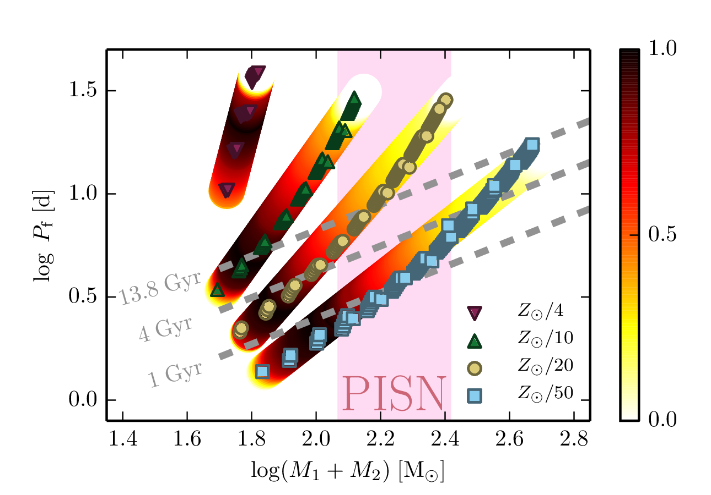

# 2016 Double BH (beware: read section on template for mesa 8845, which includes an important bugfix)

**MESA version: 8115**
but you are welcome to try/adjust these files for future versions.

To easily download these files, simply use
```
svn export https://github.com/orlox/mesa_input_data/trunk/2016_double_bh 2016_double_bh
```

Input data to reproduce results in Marchant et al. (2016), A&A 588, A50. For convenience,
we also provide input files that work with MESA version 8845. A test_suite case implementing
this channel of evolution should remain updated in the code, and can be found in
$MESA_DIR/binary/test_suite/double_bh

Throughout this README, it is assumed that the user already has MESA properly installed,
if not, follow in detail the instructions given in the [MESA website](http://mesa.sourceforge.net/prereqs.html).



## Z04, Z10, Z20, Z50
Each of these folders contains a work directory to model a binary system at different metallicities,
with Z04 corresponding to models with metallicity Zsun/4 (using Zsun=0.017 from Grevesse et al. 1996).
Masses and initial orbital periods are specified in the *inlist_extra* file,
```
&binary_controls
m1 = 70.0d0
m2 = 65.0d0
initial_period_in_days = 1.10d0
/ ! end of binary_controls namelist

```
For all templates except the one for Zsun/4, input parameters are the same.
The Zsun/4 models are different because due to the high metallicity, it was required to use
the reduction of superadiabaticity, aka MLT++ (see section 7.2 of Paxton et al. 2013).
This is specified in the files *inlist1* and *inlist2*
```
(...)
    okay_to_reduce_gradT_excess = .true.
    gradT_excess_age_fraction = 0.95d0
    gradT_excess_max_change = 0.001d0
(...)
```

The implementation of the custom wind scheme is done in *src/run_star_extras.f*. And the
condition for termination at helium depletion is set in *src/run_binary_extras.f*. The
reason to not specify this termination condition in the inlists, is because after one
component depletes helium, it is assumed to transform into a BH of the same mass, and
evolution follows assuming it is a point mass.

To run any of these models, cd into the corresponding directory, adjust inlist_extra,
compile and run
```
./clean && ./mk
./rn
```

## collapse models
For three different models at the lowest metallicity (Zsun/50), we extended evolution until
late phases. This folder contains templates for single star models, together with saved MESA
models, that are below, at, and above the PISNe mass regime. Note that due to numerical issues,
these models do not include mass loss, and are modelled with a surface boundary condition
of fixed surface pressure, otherwise severe convergence errors arise at the surface
```
which_atm_option = 'fixed_Psurf'
atm_fixed_Psurf = 1d8
```
To run any of these models, cd into the corresponding directory and run
```
./clean && ./mk
./rn
```

## data.tar.gz
This compressed file contains tables with the final fate of models with metallicities Zsun/10,
Zsun/20 and Zsun/50.

## template_8845
This is a modified template meant to work with MESA version 8845. **These files also correct a bug with
LS coupling which was reported by Martin Carrington. This modifies the results of the models, but not in
a way that modifies the conclusions of the paper.**
There are many adjustements
with respect to the older ones to improve performance, and users are advised to work from
this template unless they really need to reproduce the older results. Unlike the other templates,
this is a single template for all metallicities, with the composition specified in the
*inlist_extra_sj* file
```
&star_job
relax_initial_Z = .true.
new_Z = 0.001000000000d0
relax_initial_Y = .true.
new_Y = 0.2496d0
/ ! end of star_job namelist

&controls
Zbase = 0.001000000000d0
/ ! end of controls namelist
```

## scripts
These are mainly plotting tools and also scripts used to compute certain results. No
support provided for these, their here only for my convenience.
